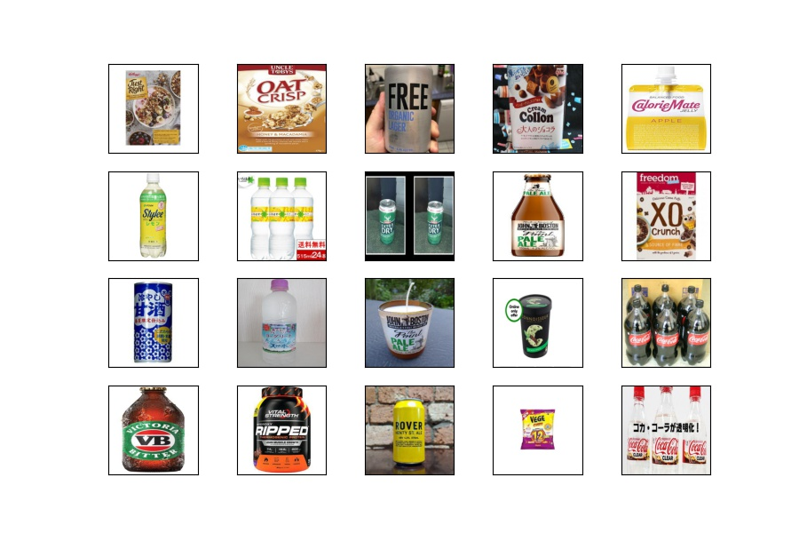
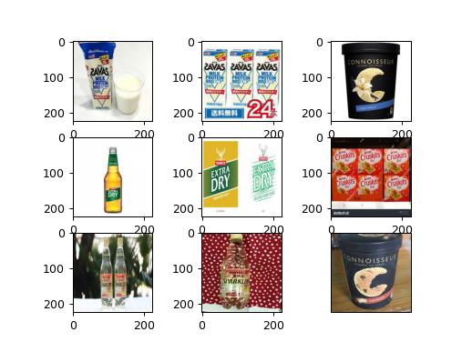
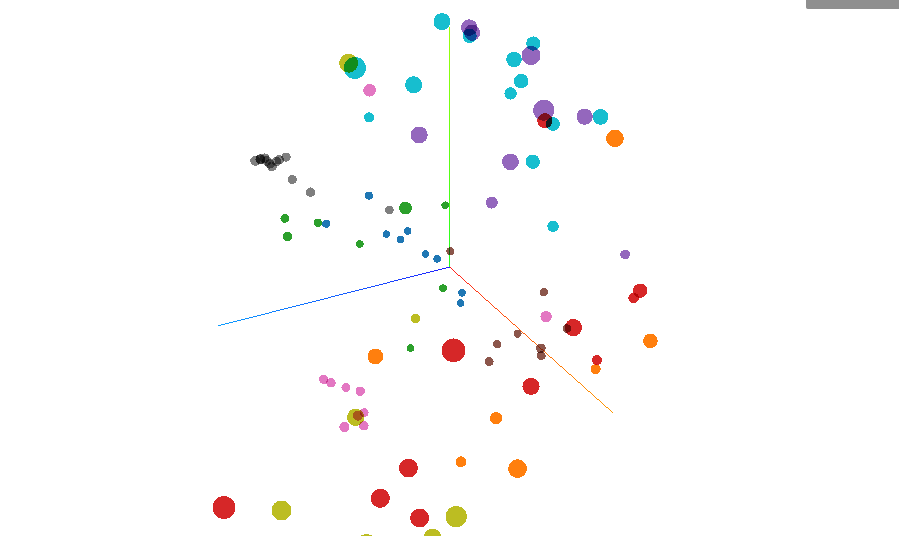
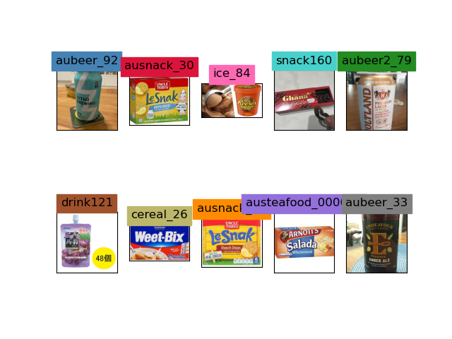
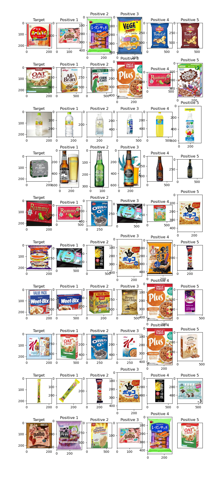

# Item Recognition using Triplet Loss and Siamese Network in Keras

This is an experiment to make a model which identifies the item (product) by the image being input and by querying DB.

Instead of using image classification technique, I wanted to use **triplet loss** to identify which product it is in DB from the image of the package of it. Since items in DB is supposed to change frequently, it won't be convenient to train the classification model with new products whenever new ones are added. I thought it needs to identify the image based on the similarity between the sample image and images in DB instead of the fixed classes.

## Repository

- `triplet_loss_smallCNN.ipynb`: code for training with small CNN.
- `triplet_loss_transferlerning.ipynb`: code for training with transfer learning.
- `triplet_loss_evaluate.ipynb`: code for evaluation.
- `Makedata.ipynb`: script to clean, resize, and divide the dataset.
- `utils.py`: a class and functions used in multiple notebooks.
- `embeddings_list.txt`: representative embeddings used in evaluation.

**NOTE** : I don't upload image dataset because the size is huge. Also I exclude some output files such as model files(`.h5`) and Tensorboard logs from this repository.

## Training and Test Data

Image data was collected on the internet. The dataset consists of around 15000 images of food products sold in Australia/Japan.

Images were stored in each directory that corresponds to each food product. There are around 800 kinds of products. Those images were divided into train/validation/test at a ratio of 8:1:1. (I ended up not using validation data.)

All images were converted to JPG file, and some images with very large size were resized.

Training data finally consists of 12070 images of 706 products.

## Learning Materials about Triplet Loss and Siamese Network

- [FaceNet: A Unified Embedding for Face Recognition and Clustering](https://arxiv.org/pdf/1503.03832.pdf)

- [Coursera "Siamese Network with Triplet Loss in Keras"](https://www.coursera.org/learn/siamese-network-triplet-loss-keras/home/welcome)

- Triplet Loss and Online Triplet Mining by Olivier Moindrot
  - Blog: [Triplet Loss and Online Triplet Mining in TensorFlow](https://omoindrot.github.io/triplet-loss)
  - GitHub: https://github.com/omoindrot/tensorflow-triplet-loss

## Triplet Loss

For each training example, I need three images:

- **Anchor** : an image of a product
- **Positive** : the other image of the same product as Anchor
- **Negative** : an image of a different product from Anchor

(`row`: each example, `column`: Anchor, Positive, Negative respectively )

Before calculating the triplet loss, I need to obtain three embeddings for Anchor(  ), Positive(   ), and Negative (   ) through the embedding model I mention in the later section. Then the loss function is calculated as following:

The difference between Anchor and Positive is:

The difference between Anchor and Negative is:

And the Triplet Loss is defined as:

*( : margin )*

## Architecture

1) Create a CNN model that output the 128 dimensional embedding of an image.

2) Define the input for each of Anchor, Positive, and Negative.

3) Concatenate all the outputs from 2)

For the CNN model, I first tried my simple and small CNN model, then I introduced transfer learning. For transfer learning, I used pretrained InceptionV3 model with attaching one global average pooling layer, one dropout, and two dense layers.

## Training

In training, data was made into triplets each of which contains anchor, positive, and negative. Default batch size was 32, and the triplets were selected when the batch was created at the beginning of each step in a epoch. The anchor was selected randomly, then the positive was selected from the same directory as the anchor but the different image from it. The negative was selected from the different directory from the anchor's.

The larger batch size might work better (for example, Cousera's triplet loss project uses 1024), my computer couldn't load that size of batch into the memory...

First I tried **Batch hard triplet loss** strategy [from Olivier Moindrot's blog](https://omoindrot.github.io/triplet-loss), but I soon found that the loss stayed at the value of margin after it quickly decreased in the first epoch. To know what was happening, I calculated **Mean of anchor-positive distances** and **Mean of anchor-negative distances** in the batch as metrics during `fit()`. Then I noticed that both distances got less quickly at an early stage in the first epoch and they were already nearly zero at the beginning of the second epoch. After that, the model didn't seem to learn any further.

Therefore, as a starting point, I decided to make triplets randomly at the creation of a batch as I mentioned earlier in this section.

## Evaluation

### VAL and FAR

I evaluated the transfer learning model that uses pretrained InceptionV3.

To evaluate the model, I calculated the following two values:

- `VAL` : The proportion of "anchor - positive" pairs which are closer than the threshold over all "anchor - positive" pairs
- `FAR` : The proportion of "anchor - negative" pairs which are closer than the threshold over all "anchor - negative" pairs

Using the test dataset, I created a batch of triplets. Then I calculated VAL and FAR with the threshold from 0.1 to 0.5. Reasonably, as I set the higher threshold, VAL increases, but FAR also increases. Finally I decided to choose `threshold = 0.28` with `VAL = 0.8515625` and `FAR = 0.1875`, which was the highest VAL where FAR is under 0.20, as a best threshold with this model.

### Embeddings

To see how the embeddings work, I visualised embeddings of images from 10 items that were randomly selected from test data using the Tensorboard Embedding Projector.

### Matching Test

I selected the most representative image in each product/item in test data directory. There were 89 items in test data, so I chose 89 representative images. Then I converted them into embeddings.

Next I selected 10 images randomly from test data (I would call them *target*). They were also turned into embeddings. For each target embeddings, I calculated the distance to every representative embedding, and keep **top 5** representative embeddings with distance below the threshold.

In this case, the corresponding representative image is detected as top 5 positives about 8 out of 10 targets.
